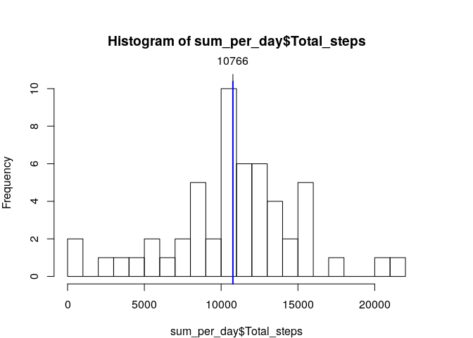
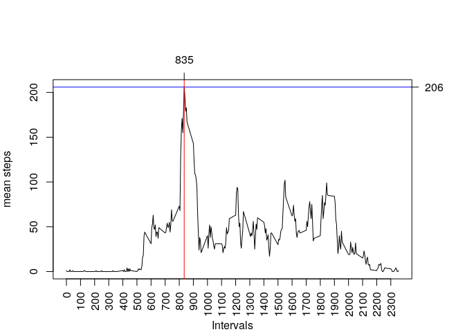
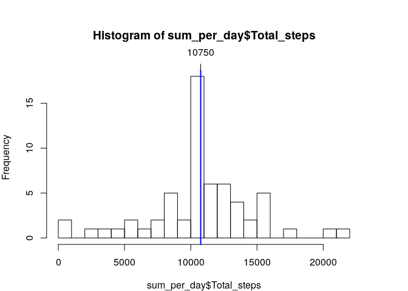
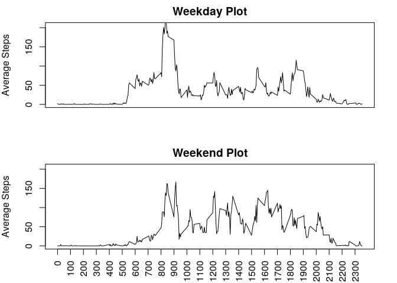

## Introduction

This assignment makes use of data from a personal activity monitoring device. This device collects data at 5 minute intervals through out the day. The data consists of two months of data from an anonymous individual collected during the months of October and November, 2012 and include the number of steps taken in 5 minute intervals each day.<https://github.com/jeromecordjotse/RepData_PeerAssessment1>

Some data analysis would be performed an the data from the activity monitoring device.


## Getting and Cleaning data

The data set is stored in the *Data* folder, or can be retrieved from [activity.zip](https://raw.githubusercontent.com/jeromecordjotse/RepData_PeerAssessment1/master/activity.zip)

```r
if(!file.exists('./data/activity.csv')){ ## Download and
    if(!file.exists('./activity.zip')){  ## unzip if dataset !exists
        download.file('https://raw.githubusercontent.com/jeromecordjotse/RepData_PeerAssessment1/master/activity.zip',destfile = './activity.zip')
    }
    unzip('activity.zip',exdir = "./data/")
}
data_untidy <- read.csv("./data/activity.csv")  ## Read the dataset
head(data_untidy,4)
```

```
##   steps       date interval
## 1    NA 2012-10-01        0
## 2    NA 2012-10-01        5
## 3    NA 2012-10-01       10
## 4    NA 2012-10-01       15
```

```r
str(data_untidy)
```

```
## 'data.frame':	17568 obs. of  3 variables:
##  $ steps   : int  NA NA NA NA NA NA NA NA NA NA ...
##  $ date    : Factor w/ 61 levels "2012-10-01","2012-10-02",..: 1 1 1 1 1 1 1 1 1 1 ...
##  $ interval: int  0 5 10 15 20 25 30 35 40 45 ...
```

```r
nrow(data_untidy[!complete.cases(data_untidy),]) # Show number of NA rows
```

```
## [1] 2304
```

The data includes some missong values. These rows would be omitted and date formatted as Data class.

```r
dataSet <- data_untidy[complete.cases(data_untidy),]  ## Select only non-missing value rows
dataSet$date <- as.POSIXct(as.Date(dataSet$date, "%Y-%m-%d"))
str(dataSet)
```

```
## 'data.frame':	15264 obs. of  3 variables:
##  $ steps   : int  0 0 0 0 0 0 0 0 0 0 ...
##  $ date    : POSIXct, format: "2012-10-02" "2012-10-02" ...
##  $ interval: int  0 5 10 15 20 25 30 35 40 45 ...
```

```r
dataSet[!complete.cases(dataSet),] # Show all NA
```

```
## [1] steps    date     interval
## <0 rows> (or 0-length row.names)
```

# Data Analysis
The analysis would be performed by way of answering questions asked about the data.
The following are the questions:


## What is mean total number of steps taken per day?

The total number of steps taken per day is calculated

```r
rownames(dataSet)<-NULL
sum_per_day <-  dataSet %>% 
    group_by(date) %>%
    summarize(Total_steps = sum(steps))
## summarize(Total_steps = sum(steps),mean_steps = mean(steps, na.rm = TRUE),median_steps = median(steps,na.rm = TRUE))
head(sum_per_day,4)
```

```
## # A tibble: 4 x 2
##   date                Total_steps
##   <dttm>                    <int>
## 1 2012-10-02 00:00:00         126
## 2 2012-10-03 00:00:00       11352
## 3 2012-10-04 00:00:00       12116
## 4 2012-10-05 00:00:00       13294
```

Below is a histogram with the centering line.

```r
par(mar=c(4,4,6,4)) # Set margin
# Plot histogram with centering line and it's value
hist(sum_per_day$Total_steps, breaks =16)
abline(v=mean(sum_per_day$Total_steps), lwd =2, col='blue')
axis(3,at=round(mean(sum_per_day$Total_steps),0),las=1)
```

<!-- -->

Mean and Median

```r
summary(sum_per_day$Total_steps)[c('Mean','Median')]
```

```
##     Mean   Median 
## 10766.19 10765.00
```

On average **10765-10766** steps are taken per day


## What is the average daily activity pattern?

The total number of steps taken per interval is calculated

```r
mean_per_interval <- dataSet %>% 
    group_by(interval) %>% 
    summarise(mean_steps=as.integer(mean(steps, na.rm = TRUE))) 
head(mean_per_interval,4)
```

```
## # A tibble: 4 x 2
##   interval mean_steps
##      <int>      <int>
## 1        0          1
## 2        5          0
## 3       10          0
## 4       15          0
```

Below time series plot on mean steps against interval


```r
par(mar=c(4,4,6,4))
## Plot time series graph with line showing maximum and it's interval values (time of occurance).
plot(mean_per_interval, type='l', xlab="Intervals", ylab="mean steps",xaxt='n')
axis(1,at=seq(0,2300,by=100),outer = FALSE,las=2)
abline(h=mean_per_interval%>%filter(mean_steps==max(mean_steps))%>%select(mean_steps), col='blue')
abline(v=mean_per_interval%>%filter(mean_steps==max(mean_steps))%>%select(interval), col='red')
axis(4,at=mean_per_interval%>%filter(mean_steps==max(mean_steps))%>%select(mean_steps),las=1)
axis(3,at=mean_per_interval%>%filter(mean_steps==max(mean_steps))%>%select(interval),las=1)
```

<!-- -->

```r
## Interactive plot
p <- mean_per_interval %>% ggplot(aes(x=interval, y=mean_steps))
p <- p + geom_area(fill="#69b3a2", alpha=0.5)
p <- p + geom_line(color="#69b3a2")
p <- p + ylab("bitcoin price ($)")
p <- p + ylab("Mean Steps")
p <- p + theme_ipsum()
iP <- ggplotly(p)
iP
```

<!--html_preserve--><div id="htmlwidget-f8530e9739e7a36b69ad" style="width:672px;height:480px;" class="plotly html-widget"></div>
<script type="application/json" data-for="htmlwidget-f8530e9739e7a36b69ad">{"x":{"data":[{"x":[0,5,10,15,20,25,30,35,40,45,50,55,100,105,110,115,120,125,130,135,140,145,150,155,200,205,210,215,220,225,230,235,240,245,250,255,300,305,310,315,320,325,330,335,340,345,350,355,400,405,410,415,420,425,430,435,440,445,450,455,500,505,510,515,520,525,530,535,540,545,550,555,600,605,610,615,620,625,630,635,640,645,650,655,700,705,710,715,720,725,730,735,740,745,750,755,800,805,810,815,820,825,830,835,840,845,850,855,900,905,910,915,920,925,930,935,940,945,950,955,1000,1005,1010,1015,1020,1025,1030,1035,1040,1045,1050,1055,1100,1105,1110,1115,1120,1125,1130,1135,1140,1145,1150,1155,1200,1205,1210,1215,1220,1225,1230,1235,1240,1245,1250,1255,1300,1305,1310,1315,1320,1325,1330,1335,1340,1345,1350,1355,1400,1405,1410,1415,1420,1425,1430,1435,1440,1445,1450,1455,1500,1505,1510,1515,1520,1525,1530,1535,1540,1545,1550,1555,1600,1605,1610,1615,1620,1625,1630,1635,1640,1645,1650,1655,1700,1705,1710,1715,1720,1725,1730,1735,1740,1745,1750,1755,1800,1805,1810,1815,1820,1825,1830,1835,1840,1845,1850,1855,1900,1905,1910,1915,1920,1925,1930,1935,1940,1945,1950,1955,2000,2005,2010,2015,2020,2025,2030,2035,2040,2045,2050,2055,2100,2105,2110,2115,2120,2125,2130,2135,2140,2145,2150,2155,2200,2205,2210,2215,2220,2225,2230,2235,2240,2245,2250,2255,2300,2305,2310,2315,2320,2325,2330,2335,2340,2345,2350,2355,2355,2355,2350,2345,2340,2335,2330,2325,2320,2315,2310,2305,2300,2255,2250,2245,2240,2235,2230,2225,2220,2215,2210,2205,2200,2155,2150,2145,2140,2135,2130,2125,2120,2115,2110,2105,2100,2055,2050,2045,2040,2035,2030,2025,2020,2015,2010,2005,2000,1955,1950,1945,1940,1935,1930,1925,1920,1915,1910,1905,1900,1855,1850,1845,1840,1835,1830,1825,1820,1815,1810,1805,1800,1755,1750,1745,1740,1735,1730,1725,1720,1715,1710,1705,1700,1655,1650,1645,1640,1635,1630,1625,1620,1615,1610,1605,1600,1555,1550,1545,1540,1535,1530,1525,1520,1515,1510,1505,1500,1455,1450,1445,1440,1435,1430,1425,1420,1415,1410,1405,1400,1355,1350,1345,1340,1335,1330,1325,1320,1315,1310,1305,1300,1255,1250,1245,1240,1235,1230,1225,1220,1215,1210,1205,1200,1155,1150,1145,1140,1135,1130,1125,1120,1115,1110,1105,1100,1055,1050,1045,1040,1035,1030,1025,1020,1015,1010,1005,1000,955,950,945,940,935,930,925,920,915,910,905,900,855,850,845,840,835,830,825,820,815,810,805,800,755,750,745,740,735,730,725,720,715,710,705,700,655,650,645,640,635,630,625,620,615,610,605,600,555,550,545,540,535,530,525,520,515,510,505,500,455,450,445,440,435,430,425,420,415,410,405,400,355,350,345,340,335,330,325,320,315,310,305,300,255,250,245,240,235,230,225,220,215,210,205,200,155,150,145,140,135,130,125,120,115,110,105,100,55,50,45,40,35,30,25,20,15,10,5,0,0],"y":[0,0,0,0,0,0,0,0,0,0,0,0,0,0,0,0,0,0,0,0,0,0,0,0,0,0,0,0,0,0,0,0,0,0,0,0,0,0,0,0,0,0,0,0,0,0,0,0,0,0,0,0,0,0,0,0,0,0,0,0,0,0,0,0,0,0,0,0,0,0,0,0,0,0,0,0,0,0,0,0,0,0,0,0,0,0,0,0,0,0,0,0,0,0,0,0,0,0,0,0,0,0,0,0,0,0,0,0,0,0,0,0,0,0,0,0,0,0,0,0,0,0,0,0,0,0,0,0,0,0,0,0,0,0,0,0,0,0,0,0,0,0,0,0,0,0,0,0,0,0,0,0,0,0,0,0,0,0,0,0,0,0,0,0,0,0,0,0,0,0,0,0,0,0,0,0,0,0,0,0,0,0,0,0,0,0,0,0,0,0,0,0,0,0,0,0,0,0,0,0,0,0,0,0,0,0,0,0,0,0,0,0,0,0,0,0,0,0,0,0,0,0,0,0,0,0,0,0,0,0,0,0,0,0,0,0,0,0,0,0,0,0,0,0,0,0,0,0,0,0,0,0,0,0,0,0,0,0,0,0,0,0,0,0,0,0,0,0,0,0,0,0,0,0,0,0,0,0,0,0,0,0,0,0,0,0,0,0,0,1,0,0,3,4,2,1,0,0,0,2,3,4,1,0,0,2,9,8,7,8,4,3,1,2,8,7,8,16,14,8,12,19,23,17,15,20,32,21,19,21,27,21,26,33,19,19,19,33,45,25,30,40,27,20,36,53,58,77,84,85,86,99,85,74,77,67,59,85,74,58,40,37,34,56,75,59,68,78,72,61,50,56,46,43,46,45,44,38,43,59,56,63,74,64,62,83,102,98,82,65,48,47,45,38,35,36,30,43,43,26,17,27,41,37,35,48,43,51,55,60,47,53,39,25,42,56,46,40,43,39,42,67,45,37,26,32,54,50,63,92,94,87,63,59,46,44,42,49,33,26,28,25,21,29,31,31,25,28,34,37,44,50,38,52,42,26,40,21,34,38,24,45,66,95,103,108,109,124,143,167,183,179,195,206,177,155,171,157,129,68,73,56,57,69,52,44,55,50,49,54,50,44,43,49,37,44,44,39,52,47,49,63,53,49,31,44,39,18,16,6,2,2,3,2,3,1,0,1,3,0,3,0,4,0,0,0,2,0,1,0,0,0,0,0,1,0,0,0,0,0,0,0,1,0,0,0,0,0,0,0,1,0,0,0,0,0,0,0,1,1,0,0,0,0,0,0,0,1,0,0,0,2,0,0,0,0,1,0],"text":["interval:    0<br />mean_steps:   1","interval:    5<br />mean_steps:   0","interval:   10<br />mean_steps:   0","interval:   15<br />mean_steps:   0","interval:   20<br />mean_steps:   0","interval:   25<br />mean_steps:   2","interval:   30<br />mean_steps:   0","interval:   35<br />mean_steps:   0","interval:   40<br />mean_steps:   0","interval:   45<br />mean_steps:   1","interval:   50<br />mean_steps:   0","interval:   55<br />mean_steps:   0","interval:  100<br />mean_steps:   0","interval:  105<br />mean_steps:   0","interval:  110<br />mean_steps:   0","interval:  115<br />mean_steps:   0","interval:  120<br />mean_steps:   0","interval:  125<br />mean_steps:   1","interval:  130<br />mean_steps:   1","interval:  135<br />mean_steps:   0","interval:  140<br />mean_steps:   0","interval:  145<br />mean_steps:   0","interval:  150<br />mean_steps:   0","interval:  155<br />mean_steps:   0","interval:  200<br />mean_steps:   0","interval:  205<br />mean_steps:   0","interval:  210<br />mean_steps:   1","interval:  215<br />mean_steps:   0","interval:  220<br />mean_steps:   0","interval:  225<br />mean_steps:   0","interval:  230<br />mean_steps:   0","interval:  235<br />mean_steps:   0","interval:  240<br />mean_steps:   0","interval:  245<br />mean_steps:   0","interval:  250<br />mean_steps:   1","interval:  255<br />mean_steps:   0","interval:  300<br />mean_steps:   0","interval:  305<br />mean_steps:   0","interval:  310<br />mean_steps:   0","interval:  315<br />mean_steps:   0","interval:  320<br />mean_steps:   0","interval:  325<br />mean_steps:   0","interval:  330<br />mean_steps:   1","interval:  335<br />mean_steps:   0","interval:  340<br />mean_steps:   0","interval:  345<br />mean_steps:   0","interval:  350<br />mean_steps:   0","interval:  355<br />mean_steps:   0","interval:  400<br />mean_steps:   1","interval:  405<br />mean_steps:   0","interval:  410<br />mean_steps:   2","interval:  415<br />mean_steps:   0","interval:  420<br />mean_steps:   0","interval:  425<br />mean_steps:   0","interval:  430<br />mean_steps:   4","interval:  435<br />mean_steps:   0","interval:  440<br />mean_steps:   3","interval:  445<br />mean_steps:   0","interval:  450<br />mean_steps:   3","interval:  455<br />mean_steps:   1","interval:  500<br />mean_steps:   0","interval:  505<br />mean_steps:   1","interval:  510<br />mean_steps:   3","interval:  515<br />mean_steps:   2","interval:  520<br />mean_steps:   3","interval:  525<br />mean_steps:   2","interval:  530<br />mean_steps:   2","interval:  535<br />mean_steps:   6","interval:  540<br />mean_steps:  16","interval:  545<br />mean_steps:  18","interval:  550<br />mean_steps:  39","interval:  555<br />mean_steps:  44","interval:  600<br />mean_steps:  31","interval:  605<br />mean_steps:  49","interval:  610<br />mean_steps:  53","interval:  615<br />mean_steps:  63","interval:  620<br />mean_steps:  49","interval:  625<br />mean_steps:  47","interval:  630<br />mean_steps:  52","interval:  635<br />mean_steps:  39","interval:  640<br />mean_steps:  44","interval:  645<br />mean_steps:  44","interval:  650<br />mean_steps:  37","interval:  655<br />mean_steps:  49","interval:  700<br />mean_steps:  43","interval:  705<br />mean_steps:  44","interval:  710<br />mean_steps:  50","interval:  715<br />mean_steps:  54","interval:  720<br />mean_steps:  49","interval:  725<br />mean_steps:  50","interval:  730<br />mean_steps:  55","interval:  735<br />mean_steps:  44","interval:  740<br />mean_steps:  52","interval:  745<br />mean_steps:  69","interval:  750<br />mean_steps:  57","interval:  755<br />mean_steps:  56","interval:  800<br />mean_steps:  73","interval:  805<br />mean_steps:  68","interval:  810<br />mean_steps: 129","interval:  815<br />mean_steps: 157","interval:  820<br />mean_steps: 171","interval:  825<br />mean_steps: 155","interval:  830<br />mean_steps: 177","interval:  835<br />mean_steps: 206","interval:  840<br />mean_steps: 195","interval:  845<br />mean_steps: 179","interval:  850<br />mean_steps: 183","interval:  855<br />mean_steps: 167","interval:  900<br />mean_steps: 143","interval:  905<br />mean_steps: 124","interval:  910<br />mean_steps: 109","interval:  915<br />mean_steps: 108","interval:  920<br />mean_steps: 103","interval:  925<br />mean_steps:  95","interval:  930<br />mean_steps:  66","interval:  935<br />mean_steps:  45","interval:  940<br />mean_steps:  24","interval:  945<br />mean_steps:  38","interval:  950<br />mean_steps:  34","interval:  955<br />mean_steps:  21","interval: 1000<br />mean_steps:  40","interval: 1005<br />mean_steps:  26","interval: 1010<br />mean_steps:  42","interval: 1015<br />mean_steps:  52","interval: 1020<br />mean_steps:  38","interval: 1025<br />mean_steps:  50","interval: 1030<br />mean_steps:  44","interval: 1035<br />mean_steps:  37","interval: 1040<br />mean_steps:  34","interval: 1045<br />mean_steps:  28","interval: 1050<br />mean_steps:  25","interval: 1055<br />mean_steps:  31","interval: 1100<br />mean_steps:  31","interval: 1105<br />mean_steps:  29","interval: 1110<br />mean_steps:  21","interval: 1115<br />mean_steps:  25","interval: 1120<br />mean_steps:  28","interval: 1125<br />mean_steps:  26","interval: 1130<br />mean_steps:  33","interval: 1135<br />mean_steps:  49","interval: 1140<br />mean_steps:  42","interval: 1145<br />mean_steps:  44","interval: 1150<br />mean_steps:  46","interval: 1155<br />mean_steps:  59","interval: 1200<br />mean_steps:  63","interval: 1205<br />mean_steps:  87","interval: 1210<br />mean_steps:  94","interval: 1215<br />mean_steps:  92","interval: 1220<br />mean_steps:  63","interval: 1225<br />mean_steps:  50","interval: 1230<br />mean_steps:  54","interval: 1235<br />mean_steps:  32","interval: 1240<br />mean_steps:  26","interval: 1245<br />mean_steps:  37","interval: 1250<br />mean_steps:  45","interval: 1255<br />mean_steps:  67","interval: 1300<br />mean_steps:  42","interval: 1305<br />mean_steps:  39","interval: 1310<br />mean_steps:  43","interval: 1315<br />mean_steps:  40","interval: 1320<br />mean_steps:  46","interval: 1325<br />mean_steps:  56","interval: 1330<br />mean_steps:  42","interval: 1335<br />mean_steps:  25","interval: 1340<br />mean_steps:  39","interval: 1345<br />mean_steps:  53","interval: 1350<br />mean_steps:  47","interval: 1355<br />mean_steps:  60","interval: 1400<br />mean_steps:  55","interval: 1405<br />mean_steps:  51","interval: 1410<br />mean_steps:  43","interval: 1415<br />mean_steps:  48","interval: 1420<br />mean_steps:  35","interval: 1425<br />mean_steps:  37","interval: 1430<br />mean_steps:  41","interval: 1435<br />mean_steps:  27","interval: 1440<br />mean_steps:  17","interval: 1445<br />mean_steps:  26","interval: 1450<br />mean_steps:  43","interval: 1455<br />mean_steps:  43","interval: 1500<br />mean_steps:  30","interval: 1505<br />mean_steps:  36","interval: 1510<br />mean_steps:  35","interval: 1515<br />mean_steps:  38","interval: 1520<br />mean_steps:  45","interval: 1525<br />mean_steps:  47","interval: 1530<br />mean_steps:  48","interval: 1535<br />mean_steps:  65","interval: 1540<br />mean_steps:  82","interval: 1545<br />mean_steps:  98","interval: 1550<br />mean_steps: 102","interval: 1555<br />mean_steps:  83","interval: 1600<br />mean_steps:  62","interval: 1605<br />mean_steps:  64","interval: 1610<br />mean_steps:  74","interval: 1615<br />mean_steps:  63","interval: 1620<br />mean_steps:  56","interval: 1625<br />mean_steps:  59","interval: 1630<br />mean_steps:  43","interval: 1635<br />mean_steps:  38","interval: 1640<br />mean_steps:  44","interval: 1645<br />mean_steps:  45","interval: 1650<br />mean_steps:  46","interval: 1655<br />mean_steps:  43","interval: 1700<br />mean_steps:  46","interval: 1705<br />mean_steps:  56","interval: 1710<br />mean_steps:  50","interval: 1715<br />mean_steps:  61","interval: 1720<br />mean_steps:  72","interval: 1725<br />mean_steps:  78","interval: 1730<br />mean_steps:  68","interval: 1735<br />mean_steps:  59","interval: 1740<br />mean_steps:  75","interval: 1745<br />mean_steps:  56","interval: 1750<br />mean_steps:  34","interval: 1755<br />mean_steps:  37","interval: 1800<br />mean_steps:  40","interval: 1805<br />mean_steps:  58","interval: 1810<br />mean_steps:  74","interval: 1815<br />mean_steps:  85","interval: 1820<br />mean_steps:  59","interval: 1825<br />mean_steps:  67","interval: 1830<br />mean_steps:  77","interval: 1835<br />mean_steps:  74","interval: 1840<br />mean_steps:  85","interval: 1845<br />mean_steps:  99","interval: 1850<br />mean_steps:  86","interval: 1855<br />mean_steps:  85","interval: 1900<br />mean_steps:  84","interval: 1905<br />mean_steps:  77","interval: 1910<br />mean_steps:  58","interval: 1915<br />mean_steps:  53","interval: 1920<br />mean_steps:  36","interval: 1925<br />mean_steps:  20","interval: 1930<br />mean_steps:  27","interval: 1935<br />mean_steps:  40","interval: 1940<br />mean_steps:  30","interval: 1945<br />mean_steps:  25","interval: 1950<br />mean_steps:  45","interval: 1955<br />mean_steps:  33","interval: 2000<br />mean_steps:  19","interval: 2005<br />mean_steps:  19","interval: 2010<br />mean_steps:  19","interval: 2015<br />mean_steps:  33","interval: 2020<br />mean_steps:  26","interval: 2025<br />mean_steps:  21","interval: 2030<br />mean_steps:  27","interval: 2035<br />mean_steps:  21","interval: 2040<br />mean_steps:  19","interval: 2045<br />mean_steps:  21","interval: 2050<br />mean_steps:  32","interval: 2055<br />mean_steps:  20","interval: 2100<br />mean_steps:  15","interval: 2105<br />mean_steps:  17","interval: 2110<br />mean_steps:  23","interval: 2115<br />mean_steps:  19","interval: 2120<br />mean_steps:  12","interval: 2125<br />mean_steps:   8","interval: 2130<br />mean_steps:  14","interval: 2135<br />mean_steps:  16","interval: 2140<br />mean_steps:   8","interval: 2145<br />mean_steps:   7","interval: 2150<br />mean_steps:   8","interval: 2155<br />mean_steps:   2","interval: 2200<br />mean_steps:   1","interval: 2205<br />mean_steps:   3","interval: 2210<br />mean_steps:   4","interval: 2215<br />mean_steps:   8","interval: 2220<br />mean_steps:   7","interval: 2225<br />mean_steps:   8","interval: 2230<br />mean_steps:   9","interval: 2235<br />mean_steps:   2","interval: 2240<br />mean_steps:   0","interval: 2245<br />mean_steps:   0","interval: 2250<br />mean_steps:   1","interval: 2255<br />mean_steps:   4","interval: 2300<br />mean_steps:   3","interval: 2305<br />mean_steps:   2","interval: 2310<br />mean_steps:   0","interval: 2315<br />mean_steps:   0","interval: 2320<br />mean_steps:   0","interval: 2325<br />mean_steps:   1","interval: 2330<br />mean_steps:   2","interval: 2335<br />mean_steps:   4","interval: 2340<br />mean_steps:   3","interval: 2345<br />mean_steps:   0","interval: 2350<br />mean_steps:   0","interval: 2355<br />mean_steps:   1","interval: 2355<br />mean_steps:   1","interval: 2355<br />mean_steps:   1","interval: 2350<br />mean_steps:   0","interval: 2345<br />mean_steps:   0","interval: 2340<br />mean_steps:   3","interval: 2335<br />mean_steps:   4","interval: 2330<br />mean_steps:   2","interval: 2325<br />mean_steps:   1","interval: 2320<br />mean_steps:   0","interval: 2315<br />mean_steps:   0","interval: 2310<br />mean_steps:   0","interval: 2305<br />mean_steps:   2","interval: 2300<br />mean_steps:   3","interval: 2255<br />mean_steps:   4","interval: 2250<br />mean_steps:   1","interval: 2245<br />mean_steps:   0","interval: 2240<br />mean_steps:   0","interval: 2235<br />mean_steps:   2","interval: 2230<br />mean_steps:   9","interval: 2225<br />mean_steps:   8","interval: 2220<br />mean_steps:   7","interval: 2215<br />mean_steps:   8","interval: 2210<br />mean_steps:   4","interval: 2205<br />mean_steps:   3","interval: 2200<br />mean_steps:   1","interval: 2155<br />mean_steps:   2","interval: 2150<br />mean_steps:   8","interval: 2145<br />mean_steps:   7","interval: 2140<br />mean_steps:   8","interval: 2135<br />mean_steps:  16","interval: 2130<br />mean_steps:  14","interval: 2125<br />mean_steps:   8","interval: 2120<br />mean_steps:  12","interval: 2115<br />mean_steps:  19","interval: 2110<br />mean_steps:  23","interval: 2105<br />mean_steps:  17","interval: 2100<br />mean_steps:  15","interval: 2055<br />mean_steps:  20","interval: 2050<br />mean_steps:  32","interval: 2045<br />mean_steps:  21","interval: 2040<br />mean_steps:  19","interval: 2035<br />mean_steps:  21","interval: 2030<br />mean_steps:  27","interval: 2025<br />mean_steps:  21","interval: 2020<br />mean_steps:  26","interval: 2015<br />mean_steps:  33","interval: 2010<br />mean_steps:  19","interval: 2005<br />mean_steps:  19","interval: 2000<br />mean_steps:  19","interval: 1955<br />mean_steps:  33","interval: 1950<br />mean_steps:  45","interval: 1945<br />mean_steps:  25","interval: 1940<br />mean_steps:  30","interval: 1935<br />mean_steps:  40","interval: 1930<br />mean_steps:  27","interval: 1925<br />mean_steps:  20","interval: 1920<br />mean_steps:  36","interval: 1915<br />mean_steps:  53","interval: 1910<br />mean_steps:  58","interval: 1905<br />mean_steps:  77","interval: 1900<br />mean_steps:  84","interval: 1855<br />mean_steps:  85","interval: 1850<br />mean_steps:  86","interval: 1845<br />mean_steps:  99","interval: 1840<br />mean_steps:  85","interval: 1835<br />mean_steps:  74","interval: 1830<br />mean_steps:  77","interval: 1825<br />mean_steps:  67","interval: 1820<br />mean_steps:  59","interval: 1815<br />mean_steps:  85","interval: 1810<br />mean_steps:  74","interval: 1805<br />mean_steps:  58","interval: 1800<br />mean_steps:  40","interval: 1755<br />mean_steps:  37","interval: 1750<br />mean_steps:  34","interval: 1745<br />mean_steps:  56","interval: 1740<br />mean_steps:  75","interval: 1735<br />mean_steps:  59","interval: 1730<br />mean_steps:  68","interval: 1725<br />mean_steps:  78","interval: 1720<br />mean_steps:  72","interval: 1715<br />mean_steps:  61","interval: 1710<br />mean_steps:  50","interval: 1705<br />mean_steps:  56","interval: 1700<br />mean_steps:  46","interval: 1655<br />mean_steps:  43","interval: 1650<br />mean_steps:  46","interval: 1645<br />mean_steps:  45","interval: 1640<br />mean_steps:  44","interval: 1635<br />mean_steps:  38","interval: 1630<br />mean_steps:  43","interval: 1625<br />mean_steps:  59","interval: 1620<br />mean_steps:  56","interval: 1615<br />mean_steps:  63","interval: 1610<br />mean_steps:  74","interval: 1605<br />mean_steps:  64","interval: 1600<br />mean_steps:  62","interval: 1555<br />mean_steps:  83","interval: 1550<br />mean_steps: 102","interval: 1545<br />mean_steps:  98","interval: 1540<br />mean_steps:  82","interval: 1535<br />mean_steps:  65","interval: 1530<br />mean_steps:  48","interval: 1525<br />mean_steps:  47","interval: 1520<br />mean_steps:  45","interval: 1515<br />mean_steps:  38","interval: 1510<br />mean_steps:  35","interval: 1505<br />mean_steps:  36","interval: 1500<br />mean_steps:  30","interval: 1455<br />mean_steps:  43","interval: 1450<br />mean_steps:  43","interval: 1445<br />mean_steps:  26","interval: 1440<br />mean_steps:  17","interval: 1435<br />mean_steps:  27","interval: 1430<br />mean_steps:  41","interval: 1425<br />mean_steps:  37","interval: 1420<br />mean_steps:  35","interval: 1415<br />mean_steps:  48","interval: 1410<br />mean_steps:  43","interval: 1405<br />mean_steps:  51","interval: 1400<br />mean_steps:  55","interval: 1355<br />mean_steps:  60","interval: 1350<br />mean_steps:  47","interval: 1345<br />mean_steps:  53","interval: 1340<br />mean_steps:  39","interval: 1335<br />mean_steps:  25","interval: 1330<br />mean_steps:  42","interval: 1325<br />mean_steps:  56","interval: 1320<br />mean_steps:  46","interval: 1315<br />mean_steps:  40","interval: 1310<br />mean_steps:  43","interval: 1305<br />mean_steps:  39","interval: 1300<br />mean_steps:  42","interval: 1255<br />mean_steps:  67","interval: 1250<br />mean_steps:  45","interval: 1245<br />mean_steps:  37","interval: 1240<br />mean_steps:  26","interval: 1235<br />mean_steps:  32","interval: 1230<br />mean_steps:  54","interval: 1225<br />mean_steps:  50","interval: 1220<br />mean_steps:  63","interval: 1215<br />mean_steps:  92","interval: 1210<br />mean_steps:  94","interval: 1205<br />mean_steps:  87","interval: 1200<br />mean_steps:  63","interval: 1155<br />mean_steps:  59","interval: 1150<br />mean_steps:  46","interval: 1145<br />mean_steps:  44","interval: 1140<br />mean_steps:  42","interval: 1135<br />mean_steps:  49","interval: 1130<br />mean_steps:  33","interval: 1125<br />mean_steps:  26","interval: 1120<br />mean_steps:  28","interval: 1115<br />mean_steps:  25","interval: 1110<br />mean_steps:  21","interval: 1105<br />mean_steps:  29","interval: 1100<br />mean_steps:  31","interval: 1055<br />mean_steps:  31","interval: 1050<br />mean_steps:  25","interval: 1045<br />mean_steps:  28","interval: 1040<br />mean_steps:  34","interval: 1035<br />mean_steps:  37","interval: 1030<br />mean_steps:  44","interval: 1025<br />mean_steps:  50","interval: 1020<br />mean_steps:  38","interval: 1015<br />mean_steps:  52","interval: 1010<br />mean_steps:  42","interval: 1005<br />mean_steps:  26","interval: 1000<br />mean_steps:  40","interval:  955<br />mean_steps:  21","interval:  950<br />mean_steps:  34","interval:  945<br />mean_steps:  38","interval:  940<br />mean_steps:  24","interval:  935<br />mean_steps:  45","interval:  930<br />mean_steps:  66","interval:  925<br />mean_steps:  95","interval:  920<br />mean_steps: 103","interval:  915<br />mean_steps: 108","interval:  910<br />mean_steps: 109","interval:  905<br />mean_steps: 124","interval:  900<br />mean_steps: 143","interval:  855<br />mean_steps: 167","interval:  850<br />mean_steps: 183","interval:  845<br />mean_steps: 179","interval:  840<br />mean_steps: 195","interval:  835<br />mean_steps: 206","interval:  830<br />mean_steps: 177","interval:  825<br />mean_steps: 155","interval:  820<br />mean_steps: 171","interval:  815<br />mean_steps: 157","interval:  810<br />mean_steps: 129","interval:  805<br />mean_steps:  68","interval:  800<br />mean_steps:  73","interval:  755<br />mean_steps:  56","interval:  750<br />mean_steps:  57","interval:  745<br />mean_steps:  69","interval:  740<br />mean_steps:  52","interval:  735<br />mean_steps:  44","interval:  730<br />mean_steps:  55","interval:  725<br />mean_steps:  50","interval:  720<br />mean_steps:  49","interval:  715<br />mean_steps:  54","interval:  710<br />mean_steps:  50","interval:  705<br />mean_steps:  44","interval:  700<br />mean_steps:  43","interval:  655<br />mean_steps:  49","interval:  650<br />mean_steps:  37","interval:  645<br />mean_steps:  44","interval:  640<br />mean_steps:  44","interval:  635<br />mean_steps:  39","interval:  630<br />mean_steps:  52","interval:  625<br />mean_steps:  47","interval:  620<br />mean_steps:  49","interval:  615<br />mean_steps:  63","interval:  610<br />mean_steps:  53","interval:  605<br />mean_steps:  49","interval:  600<br />mean_steps:  31","interval:  555<br />mean_steps:  44","interval:  550<br />mean_steps:  39","interval:  545<br />mean_steps:  18","interval:  540<br />mean_steps:  16","interval:  535<br />mean_steps:   6","interval:  530<br />mean_steps:   2","interval:  525<br />mean_steps:   2","interval:  520<br />mean_steps:   3","interval:  515<br />mean_steps:   2","interval:  510<br />mean_steps:   3","interval:  505<br />mean_steps:   1","interval:  500<br />mean_steps:   0","interval:  455<br />mean_steps:   1","interval:  450<br />mean_steps:   3","interval:  445<br />mean_steps:   0","interval:  440<br />mean_steps:   3","interval:  435<br />mean_steps:   0","interval:  430<br />mean_steps:   4","interval:  425<br />mean_steps:   0","interval:  420<br />mean_steps:   0","interval:  415<br />mean_steps:   0","interval:  410<br />mean_steps:   2","interval:  405<br />mean_steps:   0","interval:  400<br />mean_steps:   1","interval:  355<br />mean_steps:   0","interval:  350<br />mean_steps:   0","interval:  345<br />mean_steps:   0","interval:  340<br />mean_steps:   0","interval:  335<br />mean_steps:   0","interval:  330<br />mean_steps:   1","interval:  325<br />mean_steps:   0","interval:  320<br />mean_steps:   0","interval:  315<br />mean_steps:   0","interval:  310<br />mean_steps:   0","interval:  305<br />mean_steps:   0","interval:  300<br />mean_steps:   0","interval:  255<br />mean_steps:   0","interval:  250<br />mean_steps:   1","interval:  245<br />mean_steps:   0","interval:  240<br />mean_steps:   0","interval:  235<br />mean_steps:   0","interval:  230<br />mean_steps:   0","interval:  225<br />mean_steps:   0","interval:  220<br />mean_steps:   0","interval:  215<br />mean_steps:   0","interval:  210<br />mean_steps:   1","interval:  205<br />mean_steps:   0","interval:  200<br />mean_steps:   0","interval:  155<br />mean_steps:   0","interval:  150<br />mean_steps:   0","interval:  145<br />mean_steps:   0","interval:  140<br />mean_steps:   0","interval:  135<br />mean_steps:   0","interval:  130<br />mean_steps:   1","interval:  125<br />mean_steps:   1","interval:  120<br />mean_steps:   0","interval:  115<br />mean_steps:   0","interval:  110<br />mean_steps:   0","interval:  105<br />mean_steps:   0","interval:  100<br />mean_steps:   0","interval:   55<br />mean_steps:   0","interval:   50<br />mean_steps:   0","interval:   45<br />mean_steps:   1","interval:   40<br />mean_steps:   0","interval:   35<br />mean_steps:   0","interval:   30<br />mean_steps:   0","interval:   25<br />mean_steps:   2","interval:   20<br />mean_steps:   0","interval:   15<br />mean_steps:   0","interval:   10<br />mean_steps:   0","interval:    5<br />mean_steps:   0","interval:    0<br />mean_steps:   1","interval:    0<br />mean_steps:   1"],"type":"scatter","mode":"lines","line":{"width":1.88976377952756,"color":"transparent","dash":"solid"},"fill":"toself","fillcolor":"rgba(105,179,162,0.5)","hoveron":"points","showlegend":false,"xaxis":"x","yaxis":"y","hoverinfo":"text","frame":null},{"x":[0,5,10,15,20,25,30,35,40,45,50,55,100,105,110,115,120,125,130,135,140,145,150,155,200,205,210,215,220,225,230,235,240,245,250,255,300,305,310,315,320,325,330,335,340,345,350,355,400,405,410,415,420,425,430,435,440,445,450,455,500,505,510,515,520,525,530,535,540,545,550,555,600,605,610,615,620,625,630,635,640,645,650,655,700,705,710,715,720,725,730,735,740,745,750,755,800,805,810,815,820,825,830,835,840,845,850,855,900,905,910,915,920,925,930,935,940,945,950,955,1000,1005,1010,1015,1020,1025,1030,1035,1040,1045,1050,1055,1100,1105,1110,1115,1120,1125,1130,1135,1140,1145,1150,1155,1200,1205,1210,1215,1220,1225,1230,1235,1240,1245,1250,1255,1300,1305,1310,1315,1320,1325,1330,1335,1340,1345,1350,1355,1400,1405,1410,1415,1420,1425,1430,1435,1440,1445,1450,1455,1500,1505,1510,1515,1520,1525,1530,1535,1540,1545,1550,1555,1600,1605,1610,1615,1620,1625,1630,1635,1640,1645,1650,1655,1700,1705,1710,1715,1720,1725,1730,1735,1740,1745,1750,1755,1800,1805,1810,1815,1820,1825,1830,1835,1840,1845,1850,1855,1900,1905,1910,1915,1920,1925,1930,1935,1940,1945,1950,1955,2000,2005,2010,2015,2020,2025,2030,2035,2040,2045,2050,2055,2100,2105,2110,2115,2120,2125,2130,2135,2140,2145,2150,2155,2200,2205,2210,2215,2220,2225,2230,2235,2240,2245,2250,2255,2300,2305,2310,2315,2320,2325,2330,2335,2340,2345,2350,2355],"y":[1,0,0,0,0,2,0,0,0,1,0,0,0,0,0,0,0,1,1,0,0,0,0,0,0,0,1,0,0,0,0,0,0,0,1,0,0,0,0,0,0,0,1,0,0,0,0,0,1,0,2,0,0,0,4,0,3,0,3,1,0,1,3,2,3,2,2,6,16,18,39,44,31,49,53,63,49,47,52,39,44,44,37,49,43,44,50,54,49,50,55,44,52,69,57,56,73,68,129,157,171,155,177,206,195,179,183,167,143,124,109,108,103,95,66,45,24,38,34,21,40,26,42,52,38,50,44,37,34,28,25,31,31,29,21,25,28,26,33,49,42,44,46,59,63,87,94,92,63,50,54,32,26,37,45,67,42,39,43,40,46,56,42,25,39,53,47,60,55,51,43,48,35,37,41,27,17,26,43,43,30,36,35,38,45,47,48,65,82,98,102,83,62,64,74,63,56,59,43,38,44,45,46,43,46,56,50,61,72,78,68,59,75,56,34,37,40,58,74,85,59,67,77,74,85,99,86,85,84,77,58,53,36,20,27,40,30,25,45,33,19,19,19,33,26,21,27,21,19,21,32,20,15,17,23,19,12,8,14,16,8,7,8,2,1,3,4,8,7,8,9,2,0,0,1,4,3,2,0,0,0,1,2,4,3,0,0,1],"text":["interval:    0<br />mean_steps:   1","interval:    5<br />mean_steps:   0","interval:   10<br />mean_steps:   0","interval:   15<br />mean_steps:   0","interval:   20<br />mean_steps:   0","interval:   25<br />mean_steps:   2","interval:   30<br />mean_steps:   0","interval:   35<br />mean_steps:   0","interval:   40<br />mean_steps:   0","interval:   45<br />mean_steps:   1","interval:   50<br />mean_steps:   0","interval:   55<br />mean_steps:   0","interval:  100<br />mean_steps:   0","interval:  105<br />mean_steps:   0","interval:  110<br />mean_steps:   0","interval:  115<br />mean_steps:   0","interval:  120<br />mean_steps:   0","interval:  125<br />mean_steps:   1","interval:  130<br />mean_steps:   1","interval:  135<br />mean_steps:   0","interval:  140<br />mean_steps:   0","interval:  145<br />mean_steps:   0","interval:  150<br />mean_steps:   0","interval:  155<br />mean_steps:   0","interval:  200<br />mean_steps:   0","interval:  205<br />mean_steps:   0","interval:  210<br />mean_steps:   1","interval:  215<br />mean_steps:   0","interval:  220<br />mean_steps:   0","interval:  225<br />mean_steps:   0","interval:  230<br />mean_steps:   0","interval:  235<br />mean_steps:   0","interval:  240<br />mean_steps:   0","interval:  245<br />mean_steps:   0","interval:  250<br />mean_steps:   1","interval:  255<br />mean_steps:   0","interval:  300<br />mean_steps:   0","interval:  305<br />mean_steps:   0","interval:  310<br />mean_steps:   0","interval:  315<br />mean_steps:   0","interval:  320<br />mean_steps:   0","interval:  325<br />mean_steps:   0","interval:  330<br />mean_steps:   1","interval:  335<br />mean_steps:   0","interval:  340<br />mean_steps:   0","interval:  345<br />mean_steps:   0","interval:  350<br />mean_steps:   0","interval:  355<br />mean_steps:   0","interval:  400<br />mean_steps:   1","interval:  405<br />mean_steps:   0","interval:  410<br />mean_steps:   2","interval:  415<br />mean_steps:   0","interval:  420<br />mean_steps:   0","interval:  425<br />mean_steps:   0","interval:  430<br />mean_steps:   4","interval:  435<br />mean_steps:   0","interval:  440<br />mean_steps:   3","interval:  445<br />mean_steps:   0","interval:  450<br />mean_steps:   3","interval:  455<br />mean_steps:   1","interval:  500<br />mean_steps:   0","interval:  505<br />mean_steps:   1","interval:  510<br />mean_steps:   3","interval:  515<br />mean_steps:   2","interval:  520<br />mean_steps:   3","interval:  525<br />mean_steps:   2","interval:  530<br />mean_steps:   2","interval:  535<br />mean_steps:   6","interval:  540<br />mean_steps:  16","interval:  545<br />mean_steps:  18","interval:  550<br />mean_steps:  39","interval:  555<br />mean_steps:  44","interval:  600<br />mean_steps:  31","interval:  605<br />mean_steps:  49","interval:  610<br />mean_steps:  53","interval:  615<br />mean_steps:  63","interval:  620<br />mean_steps:  49","interval:  625<br />mean_steps:  47","interval:  630<br />mean_steps:  52","interval:  635<br />mean_steps:  39","interval:  640<br />mean_steps:  44","interval:  645<br />mean_steps:  44","interval:  650<br />mean_steps:  37","interval:  655<br />mean_steps:  49","interval:  700<br />mean_steps:  43","interval:  705<br />mean_steps:  44","interval:  710<br />mean_steps:  50","interval:  715<br />mean_steps:  54","interval:  720<br />mean_steps:  49","interval:  725<br />mean_steps:  50","interval:  730<br />mean_steps:  55","interval:  735<br />mean_steps:  44","interval:  740<br />mean_steps:  52","interval:  745<br />mean_steps:  69","interval:  750<br />mean_steps:  57","interval:  755<br />mean_steps:  56","interval:  800<br />mean_steps:  73","interval:  805<br />mean_steps:  68","interval:  810<br />mean_steps: 129","interval:  815<br />mean_steps: 157","interval:  820<br />mean_steps: 171","interval:  825<br />mean_steps: 155","interval:  830<br />mean_steps: 177","interval:  835<br />mean_steps: 206","interval:  840<br />mean_steps: 195","interval:  845<br />mean_steps: 179","interval:  850<br />mean_steps: 183","interval:  855<br />mean_steps: 167","interval:  900<br />mean_steps: 143","interval:  905<br />mean_steps: 124","interval:  910<br />mean_steps: 109","interval:  915<br />mean_steps: 108","interval:  920<br />mean_steps: 103","interval:  925<br />mean_steps:  95","interval:  930<br />mean_steps:  66","interval:  935<br />mean_steps:  45","interval:  940<br />mean_steps:  24","interval:  945<br />mean_steps:  38","interval:  950<br />mean_steps:  34","interval:  955<br />mean_steps:  21","interval: 1000<br />mean_steps:  40","interval: 1005<br />mean_steps:  26","interval: 1010<br />mean_steps:  42","interval: 1015<br />mean_steps:  52","interval: 1020<br />mean_steps:  38","interval: 1025<br />mean_steps:  50","interval: 1030<br />mean_steps:  44","interval: 1035<br />mean_steps:  37","interval: 1040<br />mean_steps:  34","interval: 1045<br />mean_steps:  28","interval: 1050<br />mean_steps:  25","interval: 1055<br />mean_steps:  31","interval: 1100<br />mean_steps:  31","interval: 1105<br />mean_steps:  29","interval: 1110<br />mean_steps:  21","interval: 1115<br />mean_steps:  25","interval: 1120<br />mean_steps:  28","interval: 1125<br />mean_steps:  26","interval: 1130<br />mean_steps:  33","interval: 1135<br />mean_steps:  49","interval: 1140<br />mean_steps:  42","interval: 1145<br />mean_steps:  44","interval: 1150<br />mean_steps:  46","interval: 1155<br />mean_steps:  59","interval: 1200<br />mean_steps:  63","interval: 1205<br />mean_steps:  87","interval: 1210<br />mean_steps:  94","interval: 1215<br />mean_steps:  92","interval: 1220<br />mean_steps:  63","interval: 1225<br />mean_steps:  50","interval: 1230<br />mean_steps:  54","interval: 1235<br />mean_steps:  32","interval: 1240<br />mean_steps:  26","interval: 1245<br />mean_steps:  37","interval: 1250<br />mean_steps:  45","interval: 1255<br />mean_steps:  67","interval: 1300<br />mean_steps:  42","interval: 1305<br />mean_steps:  39","interval: 1310<br />mean_steps:  43","interval: 1315<br />mean_steps:  40","interval: 1320<br />mean_steps:  46","interval: 1325<br />mean_steps:  56","interval: 1330<br />mean_steps:  42","interval: 1335<br />mean_steps:  25","interval: 1340<br />mean_steps:  39","interval: 1345<br />mean_steps:  53","interval: 1350<br />mean_steps:  47","interval: 1355<br />mean_steps:  60","interval: 1400<br />mean_steps:  55","interval: 1405<br />mean_steps:  51","interval: 1410<br />mean_steps:  43","interval: 1415<br />mean_steps:  48","interval: 1420<br />mean_steps:  35","interval: 1425<br />mean_steps:  37","interval: 1430<br />mean_steps:  41","interval: 1435<br />mean_steps:  27","interval: 1440<br />mean_steps:  17","interval: 1445<br />mean_steps:  26","interval: 1450<br />mean_steps:  43","interval: 1455<br />mean_steps:  43","interval: 1500<br />mean_steps:  30","interval: 1505<br />mean_steps:  36","interval: 1510<br />mean_steps:  35","interval: 1515<br />mean_steps:  38","interval: 1520<br />mean_steps:  45","interval: 1525<br />mean_steps:  47","interval: 1530<br />mean_steps:  48","interval: 1535<br />mean_steps:  65","interval: 1540<br />mean_steps:  82","interval: 1545<br />mean_steps:  98","interval: 1550<br />mean_steps: 102","interval: 1555<br />mean_steps:  83","interval: 1600<br />mean_steps:  62","interval: 1605<br />mean_steps:  64","interval: 1610<br />mean_steps:  74","interval: 1615<br />mean_steps:  63","interval: 1620<br />mean_steps:  56","interval: 1625<br />mean_steps:  59","interval: 1630<br />mean_steps:  43","interval: 1635<br />mean_steps:  38","interval: 1640<br />mean_steps:  44","interval: 1645<br />mean_steps:  45","interval: 1650<br />mean_steps:  46","interval: 1655<br />mean_steps:  43","interval: 1700<br />mean_steps:  46","interval: 1705<br />mean_steps:  56","interval: 1710<br />mean_steps:  50","interval: 1715<br />mean_steps:  61","interval: 1720<br />mean_steps:  72","interval: 1725<br />mean_steps:  78","interval: 1730<br />mean_steps:  68","interval: 1735<br />mean_steps:  59","interval: 1740<br />mean_steps:  75","interval: 1745<br />mean_steps:  56","interval: 1750<br />mean_steps:  34","interval: 1755<br />mean_steps:  37","interval: 1800<br />mean_steps:  40","interval: 1805<br />mean_steps:  58","interval: 1810<br />mean_steps:  74","interval: 1815<br />mean_steps:  85","interval: 1820<br />mean_steps:  59","interval: 1825<br />mean_steps:  67","interval: 1830<br />mean_steps:  77","interval: 1835<br />mean_steps:  74","interval: 1840<br />mean_steps:  85","interval: 1845<br />mean_steps:  99","interval: 1850<br />mean_steps:  86","interval: 1855<br />mean_steps:  85","interval: 1900<br />mean_steps:  84","interval: 1905<br />mean_steps:  77","interval: 1910<br />mean_steps:  58","interval: 1915<br />mean_steps:  53","interval: 1920<br />mean_steps:  36","interval: 1925<br />mean_steps:  20","interval: 1930<br />mean_steps:  27","interval: 1935<br />mean_steps:  40","interval: 1940<br />mean_steps:  30","interval: 1945<br />mean_steps:  25","interval: 1950<br />mean_steps:  45","interval: 1955<br />mean_steps:  33","interval: 2000<br />mean_steps:  19","interval: 2005<br />mean_steps:  19","interval: 2010<br />mean_steps:  19","interval: 2015<br />mean_steps:  33","interval: 2020<br />mean_steps:  26","interval: 2025<br />mean_steps:  21","interval: 2030<br />mean_steps:  27","interval: 2035<br />mean_steps:  21","interval: 2040<br />mean_steps:  19","interval: 2045<br />mean_steps:  21","interval: 2050<br />mean_steps:  32","interval: 2055<br />mean_steps:  20","interval: 2100<br />mean_steps:  15","interval: 2105<br />mean_steps:  17","interval: 2110<br />mean_steps:  23","interval: 2115<br />mean_steps:  19","interval: 2120<br />mean_steps:  12","interval: 2125<br />mean_steps:   8","interval: 2130<br />mean_steps:  14","interval: 2135<br />mean_steps:  16","interval: 2140<br />mean_steps:   8","interval: 2145<br />mean_steps:   7","interval: 2150<br />mean_steps:   8","interval: 2155<br />mean_steps:   2","interval: 2200<br />mean_steps:   1","interval: 2205<br />mean_steps:   3","interval: 2210<br />mean_steps:   4","interval: 2215<br />mean_steps:   8","interval: 2220<br />mean_steps:   7","interval: 2225<br />mean_steps:   8","interval: 2230<br />mean_steps:   9","interval: 2235<br />mean_steps:   2","interval: 2240<br />mean_steps:   0","interval: 2245<br />mean_steps:   0","interval: 2250<br />mean_steps:   1","interval: 2255<br />mean_steps:   4","interval: 2300<br />mean_steps:   3","interval: 2305<br />mean_steps:   2","interval: 2310<br />mean_steps:   0","interval: 2315<br />mean_steps:   0","interval: 2320<br />mean_steps:   0","interval: 2325<br />mean_steps:   1","interval: 2330<br />mean_steps:   2","interval: 2335<br />mean_steps:   4","interval: 2340<br />mean_steps:   3","interval: 2345<br />mean_steps:   0","interval: 2350<br />mean_steps:   0","interval: 2355<br />mean_steps:   1"],"type":"scatter","mode":"lines","line":{"width":1.88976377952756,"color":"rgba(105,179,162,1)","dash":"solid"},"hoveron":"points","showlegend":false,"xaxis":"x","yaxis":"y","hoverinfo":"text","frame":null}],"layout":{"margin":{"t":71.7907845579078,"r":39.8505603985056,"b":86.8410128684101,"l":78.5388127853881},"font":{"color":"rgba(0,0,0,1)","family":"Arial Narrow","size":15.2760481527605},"xaxis":{"domain":[0,1],"automargin":true,"type":"linear","autorange":false,"range":[-117.75,2472.75],"tickmode":"array","ticktext":["0","500","1000","1500","2000"],"tickvals":[0,500,1000,1500,2000],"categoryorder":"array","categoryarray":["0","500","1000","1500","2000"],"nticks":null,"ticks":"","tickcolor":null,"ticklen":3.81901203819012,"tickwidth":0,"showticklabels":true,"tickfont":{"color":"rgba(77,77,77,1)","family":"Arial Narrow","size":15.2760481527605},"tickangle":-0,"showline":false,"linecolor":null,"linewidth":0,"showgrid":true,"gridcolor":"rgba(204,204,204,1)","gridwidth":0.265670402656704,"zeroline":false,"anchor":"y","title":{"text":"interval","font":{"color":"rgba(0,0,0,1)","family":"Arial Narrow","size":11.9551681195517}},"hoverformat":".2f"},"yaxis":{"domain":[0,1],"automargin":true,"type":"linear","autorange":false,"range":[-10.3,216.3],"tickmode":"array","ticktext":["0","50","100","150","200"],"tickvals":[0,50,100,150,200],"categoryorder":"array","categoryarray":["0","50","100","150","200"],"nticks":null,"ticks":"","tickcolor":null,"ticklen":3.81901203819012,"tickwidth":0,"showticklabels":true,"tickfont":{"color":"rgba(77,77,77,1)","family":"Arial Narrow","size":15.2760481527605},"tickangle":-0,"showline":false,"linecolor":null,"linewidth":0,"showgrid":true,"gridcolor":"rgba(204,204,204,1)","gridwidth":0.265670402656704,"zeroline":false,"anchor":"x","title":{"text":"Mean Steps","font":{"color":"rgba(0,0,0,1)","family":"Arial Narrow","size":11.9551681195517}},"hoverformat":".2f"},"shapes":[{"type":"rect","fillcolor":null,"line":{"color":null,"width":0,"linetype":[]},"yref":"paper","xref":"paper","x0":0,"x1":1,"y0":0,"y1":1}],"showlegend":false,"legend":{"bgcolor":null,"bordercolor":null,"borderwidth":0,"font":{"color":"rgba(0,0,0,1)","family":"Arial Narrow","size":12.2208385222084}},"hovermode":"closest","barmode":"relative"},"config":{"doubleClick":"reset","showSendToCloud":false},"source":"A","attrs":{"49083a782703":{"x":{},"y":{},"type":"scatter"},"49082143c3db":{"x":{},"y":{}}},"cur_data":"49083a782703","visdat":{"49083a782703":["function (y) ","x"],"49082143c3db":["function (y) ","x"]},"highlight":{"on":"plotly_click","persistent":false,"dynamic":false,"selectize":false,"opacityDim":0.2,"selected":{"opacity":1},"debounce":0},"shinyEvents":["plotly_hover","plotly_click","plotly_selected","plotly_relayout","plotly_brushed","plotly_brushing","plotly_clickannotation","plotly_doubleclick","plotly_deselect","plotly_afterplot","plotly_sunburstclick"],"base_url":"https://plot.ly"},"evals":[],"jsHooks":[]}</script><!--/html_preserve-->
Interval with maximum mean steps

```r
filter(mean_per_interval,mean_steps==max(mean_steps)) # Get maximum Mean Steps
```

```
## # A tibble: 1 x 2
##   interval mean_steps
##      <int>      <int>
## 1      835        206
```
Maximum mean steps is at 835.*(Red Line)*
The pattern is such that it is almost zero till 500 *5 am*. This is equivalent to first 8 hours. It rises till it maximises at the 835 minute interval, by day *8:35 AM*.

## Imputing missing values
Number of NA rows is

```r
sum(!complete.cases(data_untidy))
```

```
## [1] 2304
```
These NAs are going to be replaced by the average steps at their respective interval. This is coerced into integers.

```r
data_na_rm <- data_untidy %>% 
    group_by(interval) %>% 
    mutate(new_steps=replace(steps, is.na(steps) ,as.integer(mean(steps, na.rm = TRUE)))) %>% 
    ungroup() %>% 
    select(new_steps,date,interval) %>% 
    rename(steps=new_steps)
data_na_rm$date <- as.POSIXct(as.Date(data_na_rm$date, "%Y-%m-%d")) ## Formatting Date
head(data_na_rm,4)
```

```
## # A tibble: 4 x 3
##   steps date                interval
##   <int> <dttm>                 <int>
## 1     1 2012-10-01 00:00:00        0
## 2     0 2012-10-01 00:00:00        5
## 3     0 2012-10-01 00:00:00       10
## 4     0 2012-10-01 00:00:00       15
```

```r
str(data_na_rm)
```

```
## tibble [17,568 × 3] (S3: tbl_df/tbl/data.frame)
##  $ steps   : int [1:17568] 1 0 0 0 0 2 0 0 0 1 ...
##  $ date    : POSIXct[1:17568], format: "2012-10-01" "2012-10-01" ...
##  $ interval: int [1:17568] 0 5 10 15 20 25 30 35 40 45 ...
```
A histo

```r
rownames(data_na_rm)<-NULL
sum_per_day <- data_na_rm %>% 
    group_by(date) %>% 
    summarize(Total_steps = sum(steps))
head(sum_per_day,4)
```

```
## # A tibble: 4 x 2
##   date                Total_steps
##   <dttm>                    <int>
## 1 2012-10-01 00:00:00       10641
## 2 2012-10-02 00:00:00         126
## 3 2012-10-03 00:00:00       11352
## 4 2012-10-04 00:00:00       12116
```

Below is a histogram with the centering line.

```r
par(mar=c(4,4,6,4))
hist(sum_per_day$Total_steps, breaks =16)
abline(v=mean(sum_per_day$Total_steps), lwd =2, col='blue')
axis(3,at=round(mean(sum_per_day$Total_steps),0),las=1)
```

<!-- -->

Mean and Median

```r
summary(sum_per_day$Total_steps)[c('Mean','Median')]
```

```
##     Mean   Median 
## 10749.77 10641.00
```
Filling in the missing values with averages at respective interval moves the average to **10750** steps are taken per day. Also the center bar gets longer.

## Are there differences in activity patterns between weekdays and weekends?

A factor variable is added in the dataset with two levels – “weekday” and “weekend”

```r
data_na_rm<-data_na_rm %>% 
    mutate(day = weekdays(date) %in% c("Sunday","Saturday"))
data_na_rm$day<-as.factor(data_na_rm$day)
levels(data_na_rm$day) <- c("weekday","weekend")
```

Plot based on the weekday type.

```r
#par(mfcol=c(2,1),mar=c(3,4,2,2), oma=c(0,0,0,0))
xyplot(mean_steps ~ interval | day, 
       data = data_na_rm %>%
           group_by(interval, day) %>%
           summarise(mean_steps=mean(steps)), type = 'l', layout = c(1,2),
       ylab = list(
           label="Average Steps",
           cex = 0.75
       ))
```

<!-- -->

```r
#with(
#    data_na_rm %>% 
#        group_by(interval, day) %>% 
#        summarise(mean_steps=mean(steps)) %>% 
#        filter(day=="weekday"),
#    plot(mean_steps ~ interval,type='l', main="Weekday Plot", ylab="Average Steps", xaxt="n",  ylim=range(0:205),xlab=NA)
#)
#with(
#    data_na_rm %>% 
#        group_by(interval, day) %>% 
#        summarise(mean_steps=mean(steps)) %>% 
#        filter(day=="weekend"),
#    plot(mean_steps ~ interval,type='l', main="Weekend Plot", ylab="Average Steps", xaxt="n",  ylim=range(0:205)))
#axis(1,at=seq(0,2300,by=100),outer = FALSE,las=2)
#par(mfcol=c(1,1))
```

More steps are taken on the weekdays.

```r
data_na_rm %>% 
    group_by(day) %>% 
    summarise(total_steps=sum(steps))
```

```
## # A tibble: 2 x 2
##   day     total_steps
##   <fct>         <int>
## 1 weekday      460762
## 2 weekend      194974
```


## Conclusion
A lot of information and questions can be answered from such *Wearables Data* as seen above, which is just a tip of the iceberg. Further Statistical Inferences can be made from regressional analysis and Predictions made from Machine Learning models with these Data.
