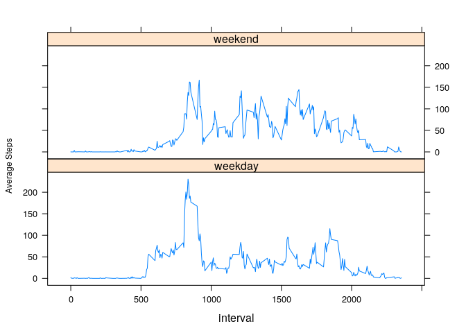

## Introduction

This assignment makes use of data from a personal activity monitoring device. This device collects data at 5 minute intervals through out the day. The data consists of two months of data from an anonymous individual collected during the months of October and November, 2012 and include the number of steps taken in 5 minute intervals each day.<https://github.com/jeromecordjotse/RepData_PeerAssessment1>

Some data analysis would be performed an the data from the activity monitoring device.


## Getting and Cleaning data

The data set is stored in the *Data* folder, or can be retrieved from [activity.zip](https://raw.githubusercontent.com/jeromecordjotse/RepData_PeerAssessment1/master/activity.zip)

```r
if(!file.exists('./data/activity.csv')){ ## Download and
    if(!file.exists('./activity.zip')){  ## unzip if dataset !exists
        download.file('https://raw.githubusercontent.com/jeromecordjotse/RepData_PeerAssessment1/master/activity.zip',destfile = './activity.zip')
    }
    unzip('activity.zip',exdir = "./data/")
}
data_untidy <- read.csv("./data/activity.csv")  ## Read the dataset
head(data_untidy,4)
```

```
##   steps       date interval
## 1    NA 2012-10-01        0
## 2    NA 2012-10-01        5
## 3    NA 2012-10-01       10
## 4    NA 2012-10-01       15
```

```r
str(data_untidy)
```

```
## 'data.frame':	17568 obs. of  3 variables:
##  $ steps   : int  NA NA NA NA NA NA NA NA NA NA ...
##  $ date    : Factor w/ 61 levels "2012-10-01","2012-10-02",..: 1 1 1 1 1 1 1 1 1 1 ...
##  $ interval: int  0 5 10 15 20 25 30 35 40 45 ...
```

```r
nrow(data_untidy[!complete.cases(data_untidy),]) # Show number of NA rows
```

```
## [1] 2304
```

The data includes some missong values. These rows would be omitted and date formatted as Data class.

```r
dataSet <- data_untidy[complete.cases(data_untidy),]  ## Select only non-missing value rows
dataSet$date <- as.POSIXct(as.Date(dataSet$date, "%Y-%m-%d"))
str(dataSet)
```

```
## 'data.frame':	15264 obs. of  3 variables:
##  $ steps   : int  0 0 0 0 0 0 0 0 0 0 ...
##  $ date    : POSIXct, format: "2012-10-02" "2012-10-02" ...
##  $ interval: int  0 5 10 15 20 25 30 35 40 45 ...
```

```r
dataSet[!complete.cases(dataSet),] # Show all NA
```

```
## [1] steps    date     interval
## <0 rows> (or 0-length row.names)
```

# Data Analysis
The analysis would be performed by way of answering questions asked about the data.
The following are the questions:


## What is mean total number of steps taken per day?

The total number of steps taken per day is calculated

```r
rownames(dataSet)<-NULL
sum_per_day <-  dataSet %>% 
    group_by(date) %>%
    summarize(Total_steps = sum(steps))
## summarize(Total_steps = sum(steps),mean_steps = mean(steps, na.rm = TRUE),median_steps = median(steps,na.rm = TRUE))
head(sum_per_day,4)
```

```
## # A tibble: 4 x 2
##   date                Total_steps
##   <dttm>                    <int>
## 1 2012-10-02 00:00:00         126
## 2 2012-10-03 00:00:00       11352
## 3 2012-10-04 00:00:00       12116
## 4 2012-10-05 00:00:00       13294
```

Below is a histogram with the centering line.

```r
par(mar=c(4,4,6,4)) # Set margin
# Plot histogram with centering line and it's value
hist(sum_per_day$Total_steps, breaks =16)
abline(v=mean(sum_per_day$Total_steps), lwd =2, col='blue')
axis(3,at=round(mean(sum_per_day$Total_steps),0),las=1)
```

<!-- -->

Mean and Median

```r
summary(sum_per_day$Total_steps)[c('Mean','Median')]
```

```
##     Mean   Median 
## 10766.19 10765.00
```

On average **10765-10766** steps are taken per day


## What is the average daily activity pattern?

The total number of steps taken per interval is calculated

```r
mean_per_interval <- dataSet %>% 
    group_by(interval) %>% 
    summarise(mean_steps=as.integer(mean(steps, na.rm = TRUE))) 
head(mean_per_interval,4)
```

```
## # A tibble: 4 x 2
##   interval mean_steps
##      <int>      <int>
## 1        0          1
## 2        5          0
## 3       10          0
## 4       15          0
```

Below time series plot on mean steps against interval


```r
par(mar=c(4,4,6,4))
## Plot time series graph with line showing maximum and it's interval values (time of occurance).
plot(mean_per_interval, type='l', xlab="Intervals", ylab="mean steps",xaxt='n')
axis(1,at=seq(0,2300,by=100),outer = FALSE,las=2)
abline(h=mean_per_interval%>%filter(mean_steps==max(mean_steps))%>%select(mean_steps), col='blue')
abline(v=mean_per_interval%>%filter(mean_steps==max(mean_steps))%>%select(interval), col='red')
axis(4,at=mean_per_interval%>%filter(mean_steps==max(mean_steps))%>%select(mean_steps),las=1)
axis(3,at=mean_per_interval%>%filter(mean_steps==max(mean_steps))%>%select(interval),las=1)
```

<!-- -->
Interval with maximum mean steps

```r
filter(mean_per_interval,mean_steps==max(mean_steps)) # Get maximum Mean Steps
```

```
## # A tibble: 1 x 2
##   interval mean_steps
##      <int>      <int>
## 1      835        206
```
Maximum mean steps is at 835.*(Red Line)*
The pattern is such that it is almost zero till 500 *5 am*. This is equivalent to first 8 hours. It rises till it maximises at the 835 minute interval, by day *8:35 AM*.

## Imputing missing values
Number of NA rows is

```r
sum(!complete.cases(data_untidy))
```

```
## [1] 2304
```
These NAs are going to be replaced by the average steps at their respective interval. This is coerced into integers.

```r
data_na_rm <- data_untidy %>% 
    group_by(interval) %>% 
    mutate(new_steps=replace(steps, is.na(steps) ,as.integer(mean(steps, na.rm = TRUE)))) %>% 
    ungroup() %>% 
    select(new_steps,date,interval) %>% 
    rename(steps=new_steps)
data_na_rm$date <- as.POSIXct(as.Date(data_na_rm$date, "%Y-%m-%d")) ## Formatting Date
head(data_na_rm,4)
```

```
## # A tibble: 4 x 3
##   steps date                interval
##   <int> <dttm>                 <int>
## 1     1 2012-10-01 00:00:00        0
## 2     0 2012-10-01 00:00:00        5
## 3     0 2012-10-01 00:00:00       10
## 4     0 2012-10-01 00:00:00       15
```

```r
str(data_na_rm)
```

```
## tibble [17,568 × 3] (S3: tbl_df/tbl/data.frame)
##  $ steps   : int [1:17568] 1 0 0 0 0 2 0 0 0 1 ...
##  $ date    : POSIXct[1:17568], format: "2012-10-01" "2012-10-01" ...
##  $ interval: int [1:17568] 0 5 10 15 20 25 30 35 40 45 ...
```
A histo

```r
rownames(data_na_rm)<-NULL
sum_per_day <- data_na_rm %>% 
    group_by(date) %>% 
    summarize(Total_steps = sum(steps))
head(sum_per_day,4)
```

```
## # A tibble: 4 x 2
##   date                Total_steps
##   <dttm>                    <int>
## 1 2012-10-01 00:00:00       10641
## 2 2012-10-02 00:00:00         126
## 3 2012-10-03 00:00:00       11352
## 4 2012-10-04 00:00:00       12116
```

Below is a histogram with the centering line.

```r
par(mar=c(4,4,6,4))
hist(sum_per_day$Total_steps, breaks =16)
abline(v=mean(sum_per_day$Total_steps), lwd =2, col='blue')
axis(3,at=round(mean(sum_per_day$Total_steps),0),las=1)
```

<!-- -->

Mean and Median

```r
summary(sum_per_day$Total_steps)[c('Mean','Median')]
```

```
##     Mean   Median 
## 10749.77 10641.00
```
Filling in the missing values with averages at respective interval moves the average to **10750** steps are taken per day. Also the center bar gets longer.

## Are there differences in activity patterns between weekdays and weekends?

A factor variable is added in the dataset with two levels – “weekday” and “weekend”

```r
data_na_rm<-data_na_rm %>% 
    mutate(day = weekdays(date) %in% c("Sunday","Saturday"))
data_na_rm$day<-as.factor(data_na_rm$day)
levels(data_na_rm$day) <- c("weekday","weekend")
```

Plot based on the weekday type.

```r
#par(mfcol=c(2,1),mar=c(3,4,2,2), oma=c(0,0,0,0))
xyplot(mean_steps ~ interval | day, 
       data = data_na_rm %>%
           group_by(interval, day) %>%
           summarise(mean_steps=mean(steps)), type = 'l', layout = c(1,2),
       ylab = list(
           label="Average Steps",
           cex = 0.75
       ))
```

<!-- -->

```r
#with(
#    data_na_rm %>% 
#        group_by(interval, day) %>% 
#        summarise(mean_steps=mean(steps)) %>% 
#        filter(day=="weekday"),
#    plot(mean_steps ~ interval,type='l', main="Weekday Plot", ylab="Average Steps", xaxt="n",  ylim=range(0:205),xlab=NA)
#)
#with(
#    data_na_rm %>% 
#        group_by(interval, day) %>% 
#        summarise(mean_steps=mean(steps)) %>% 
#        filter(day=="weekend"),
#    plot(mean_steps ~ interval,type='l', main="Weekend Plot", ylab="Average Steps", xaxt="n",  ylim=range(0:205)))
#axis(1,at=seq(0,2300,by=100),outer = FALSE,las=2)
#par(mfcol=c(1,1))
```

More steps are taken on the weekdays.

```r
data_na_rm %>% 
    group_by(day) %>% 
    summarise(total_steps=sum(steps))
```

```
## # A tibble: 2 x 2
##   day     total_steps
##   <fct>         <int>
## 1 weekday      460762
## 2 weekend      194974
```


## Conclusion
A lot of information and questions can be answered from such *Wearables Data* as seen above, which is just a tip of the iceberg. Further Statistical Inferences can be made from regressional analysis and Predictions made from Machine Learning models with these Data.
